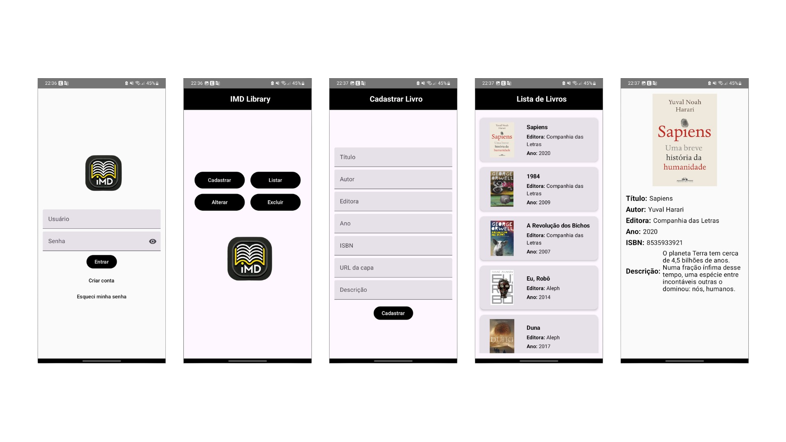

# 📚 Sistema de Gerenciamento de Livros

## 🎯 Objetivo
Este projeto tem como objetivo desenvolver um **sistema de gerenciamento de livros** utilizando as melhores práticas de desenvolvimento Android, como arquitetura MVVM e Jetpack Compose. O sistema permite o cadastro, edição, exclusão e visualização de livros, além do gerenciamento de usuários com funcionalidades de login e registro

## ✨ Funcionalidades Principais
1. **📖 Cadastro de livros:**
   - Inclui título, autor, editora, ano de publicação, descrição, ISBN e URL da capa do livro.
2. **📚 Listagem de livros:**
   - Exibe os livros cadastrados em uma lista utilizando **LazyColumn** e imagens carregadas por URL.
   - **LazyColumn** foi utilizado em vez de RecyclerView para aproveitar a integração mais natural com Jetpack Compose.
3. **✏️ Edição e 🗑️ exclusão de livros:**
   - Permite modificar as informações de um livro existente ou removê-lo.
4. **👥 Gerenciamento de usuários:**
   - Cadastro de novos usuários e login com validação.
5. **🎨 Interface moderna:**
   - Utiliza **Material Design 3** para uma experiência de usuário intuitiva e responsiva.

## 🖼️ Prints das Telas


## 🎥 Demonstração
[](https://www.youtube.com/watch?v=1N90JNdKwsY&t=1s)

## 🎓 Público-alvo
Este sistema foi desenvolvido como parte de uma disciplina acadêmica e tem como público-alvo professores.

## 🛠️ Tecnologias Utilizadas
- **Kotlin:** Linguagem principal para o desenvolvimento.
- **Jetpack Compose:** Para a criação da interface de usuário.
- **Room Database:** Para persistência local dos dados.
- **Glide:** Para carregamento eficiente das imagens através de URLs.

## 📋 Requisitos
- **compileSdk e targetSdk:** 34
- **minSdk:** 24
- **IDE:** Android Studio Dolphin ou superior.

## 🗂️ Estrutura do Projeto
Abaixo está a estrutura de pastas do projeto:
```
.
├── data
│   ├── database
│   │   ├── BookDAO.kt
│   │   ├── BookDatabase.kt
│   │   └── UserDAO.kt
│   ├── model
│   │   ├── Book.kt
│   │   └── User.kt
│   └── repository
│       ├── BookRepository.kt
│       └── UserRepository.kt
├── MainActivity.kt
├── ui
│   ├── navigation
│   │   └── AppNavigation.kt
│   ├── screens
│   │   ├── BookCreateScreen.kt
│   │   ├── BookDeleteScreen.kt
│   │   ├── BookDetailScreen.kt
│   │   ├── BookEditScreen.kt
│   │   ├── BookListScreen.kt
│   │   ├── BookManagementScreen.kt
│   │   ├── ForgotPasswordScreen.kt
│   │   ├── LoginScreen.kt
│   │   └── RegisterScreen.kt
│   └── theme
│       ├── Color.kt
│       ├── Theme.kt
│       └── Type.kt
└── viewmodel
    ├── BookViewModelFactory.kt
    ├── BookViewModel.kt
    ├── UserViewModelFactory.kt
    └── UserViewModel.kt
```

## 🏛️ Arquitetura MVVM
O projeto segue a arquitetura **MVVM** (Model-View-ViewModel), que organiza o código em três camadas principais:
1. **📂 Model:** Responsável pelos dados do aplicativo, persistência e regras de negócio. Contém os DAOs e os repositórios para livros e usuários.
2. **⚙️ ViewModel:** Atua como um intermediário entre a Model e a View. Gerencia o estado da interface e as interações do usuário.
3. **🎨 View:** Contém as telas do aplicativo, implementadas com Jetpack Compose. Utiliza os dados fornecidos pelo ViewModel para renderizar a interface.

## 🚀 Como Rodar o Projeto
1. Clone este repositório.
2. Abra o projeto no **Android Studio**.
3. Certifique-se de que o **emulador** ou dispositivo físico está configurado.
4. Clique em **Run** para compilar e executar o aplicativo.

---

Este projeto foi desenvolvido como parte de um trabalho acadêmico, buscando aplicar conceitos básicos de desenvolvimento Android.
